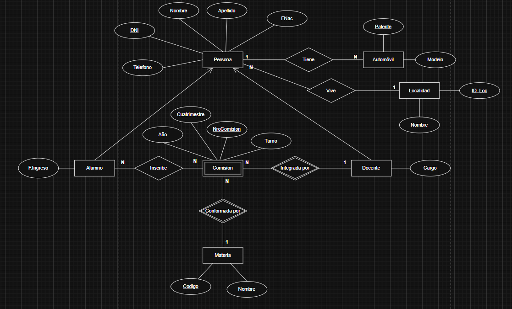

# Utililerias para trabajar con SQL

## Estructura de carperas
- main.sql
    - _scripts
    - fn
    - mod
    - req
    - sp 
    - tb 
    - tg
    - vw

## Ejemplo de modelo entidad relación del ejercicio



> Para poder correrlo hay que crear la base de datos <b>db_utils</b> incluída en el repositorio.
Todo lo que se encuentre dentro de esa base de datos es código para la reutilización.

## Dependencias (db_utils)

Creación de esquemas necesarios para las dependencias.

```SQL
/**
   Funcionalidades reutilizables para colaborar con los diseños de otras bases de datos
   1 - CREAR LA BASE DE DATOS Y LOS ESQUEMAS
   
   2 - FN
   /fn/fn_validate_dni.sql
   /fn/fn_validate_email.sql

   3 - SP
   /sp/format/sp_format_tittle.sql
   /sp/random/sp_date_random
   /sp/random/sp_letter_random
   /sp/random/sp_number_random
*/


----------- PRIMERO
USE master 

IF NOT EXISTS (SELECT name FROM sys.databases WHERE name = 'db_utils')
BEGIN
    CREATE DATABASE db_utils
    COLLATE SQL_Latin1_General_CP1_CI_AS
END 
---------------------------------------------------------------------------
-------------- SEGUNDO
USE db_utils

IF NOT EXISTS (SELECT * FROM sys.schemas WHERE name = 'library')
BEGIN
   EXEC('CREATE SCHEMA library') -- Esquema donde están todos los elementos
END 

IF NOT EXISTS (SELECT * FROM sys.schemas WHERE name = 'test')
BEGIN
   EXEC('CREATE SCHEMA test') -- Test unitarios de los elementos
END 
--------------------------------------------------------------------
```

### Estructura
- main.sql   
    - fn
        - f_validate_dni.sql 
        - fn_validate_email.sql
    - sp
        - format
            - sp_format_tittle.sql
        - random
            - sp_sate_random.sql
            - sp_str_letter_random.sql
            - sp_str_number_random.sql
 


[Documetación Dependencias](utils/README.md)

## Ejemplo de base de datos

Un ejemplo de una base de datos utilizando las funcionalidades de ```db_utils```.

### main.sql

```SQL
/***
    1 - PRIORIDAD
    Abrir el proyecto (db_utils 'DEPENDENCIAS') y crear la base de datos con todos 
    los elementos como se describe en la documentación

    2 - BASE DE DATOS (Código de abajo en este archivo)
    ESQUEMAS (Código de abajo en este archivo)

    3 - PROCEDIMINETOS
    /sp/random/sp_crear_dni_aleatorio.sql (Crear dni aleatorios)
    /sp/insercion/sp_insertar_comision.sql
    /sp/insercion/sp_inscribirse_materia.sql

    4 - FUNCIONES
    /fn/fn_selector_turnos.sql

    5 - SCRIPTS (Sólo para probar)
    *** Sólo para pruebas No para producción ***
    /_scripts/_crear_tablas.sql (Está todo el lote de prueba)

    6(OPCIONAL) - TABLAS (Para generar BD Vacía)
    /tb/tb_tipo_doc.sql
    /tb/tb_localidad.sql
    /tb/tb_persona.sql
*/
-------------PRIMERO
USE MASTER

IF NOT EXISTS (SELECT * FROM sys.databases WHERE name = 'db_tp_bd_aplicada')
BEGIN 
    CREATE DATABASE db_tp_bd_aplicada
    COLLATE sql_latin1_general_cp1_ci_as
END
------------------------------------------------------------------

------------SEGUNDO
USE db_tp_bd_aplicada

IF NOT EXISTS (SELECT 1 FROM sys.schemas WHERE name = 'negocio')
BEGIN 
    EXEC('CREATE SCHEMA negocio')
END

IF NOT EXISTS (SELECT 1 FROM sys.schemas WHERE name = 'test')
BEGIN 
    EXEC('CREATE SCHEMA test')
END
---------------------------------------------------------------------------------
```

### Autor
[FedeManzano](https://github.com/FedeManzano)

